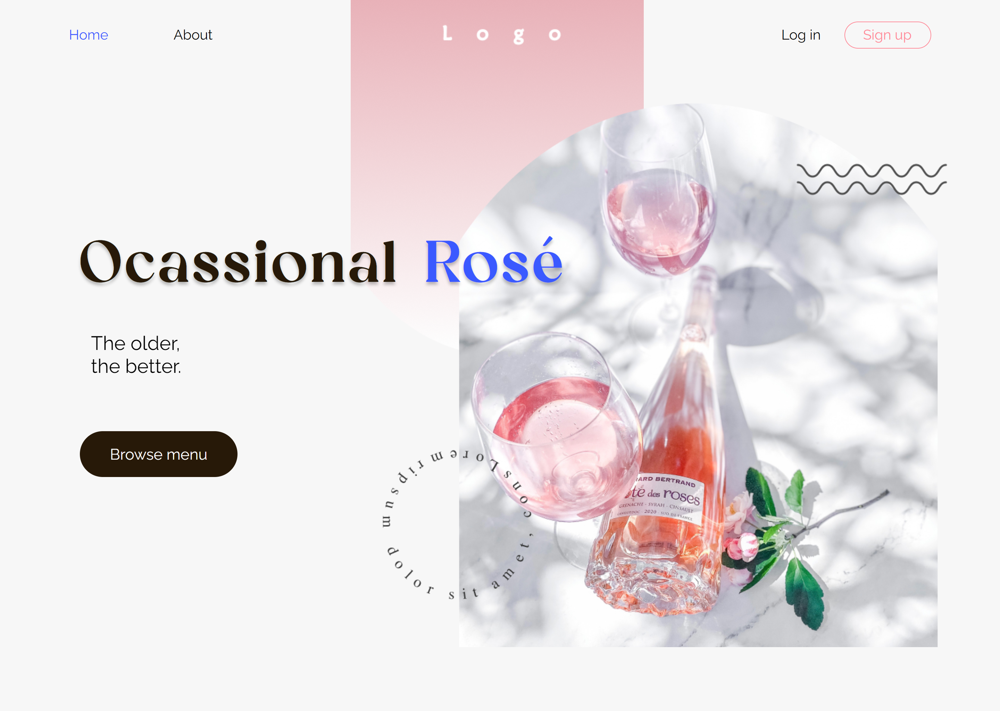

# Criando Landing Page
>Praticando com landing page, para manter o conhecimento em dia, por que é sempre bom estudar mais :D

- linguagem marcação: HTML
- linguagem de estilo: CSS

## Primeiro resultando
>Quando pensei que estava pronto

## Segundo resultado
>E está bem parecido

Referencia: [Figma!](https://www.figma.com/file/qkkUmNBIjRt3uoQLUXvEWX/Landing-page-design-(Community)?node-id=0%3A1&t=hbI2JtZ9dJfw6JQe-0)